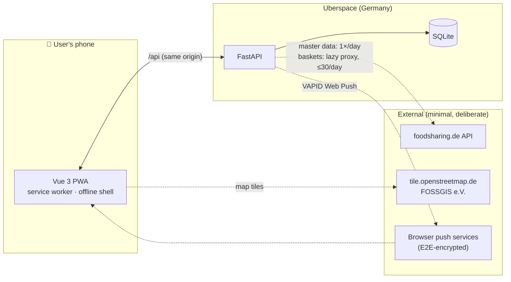
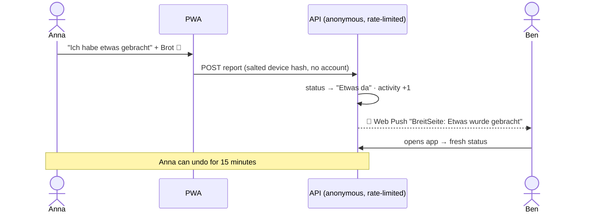

# 🥕 Fairteiler Aachen

**Live: [fairteiler-aachen.de](https://fairteiler-aachen.de)**

[](https://github.com/DeastinY/fairteiler-aachen/actions/workflows/ci.yml)
[](LICENSE)
[](#development)
[](https://fairteiler-aachen.de)
[](#features)
[](#privacy)
[](#ai-disclosure)

Is there food in the Fairteiler right now? A mobile-first companion PWA for
the public food-share points in Aachen: crowd-reported live status in ten
seconds, no account, no tracking — built to **complement
[foodsharing.de](https://foodsharing.de/region/aachen), not replace it**.

> [!IMPORTANT]
> ### AI disclosure
> This codebase was written almost entirely by an AI (**Claude Code**),
> working under the direction and review of a human maintainer — what the
> kids call *vibe-coded*, taken seriously: every feature is test-driven
> (**345 automated tests** incl. a real-backend E2E journey, ~95 %
> statement coverage), audited for accessibility (WCAG 2.1 AA, zero axe
> violations) and reviewed for translation quality. Treat it like any
> young codebase regardless: read before you trust, and
> [open an issue](https://github.com/DeastinY/fairteiler-aachen/issues)
> when something smells off.

## Screenshots

*English UI shown; the app ships in nine languages. Sample reports for illustration.*

| Map | List | Detail | Transparency |
|:---:|:---:|:---:|:---:|
|  |  |  |  |

## Features

- 🗺️ **Live map** (OpenStreetMap via FOSSGIS e.V.) with status-colored pins,
  navigation-style selection, opening hours, and cross-border coverage
  (Kelmis, Eynatten, Hauset)
- ⚡ **Report in ~10 seconds** — brought / taken / empty / condition, anonymous,
  no account, 15-minute undo
- 🔔 **Push notifications** when food arrives at your favorite Fairteiler —
  standard Web Push, self-hosted VAPID, **no Google services**, quiet hours
- 🌍 **Nine languages**: Deutsch, English, Türkçe, العربية (RTL), Русский,
  Polski, Українська, Nederlands, Français
- 🧺 **Essenskörbe**: public food baskets nearby, deep-linked to foodsharing.de
- 📊 **Radical transparency**: anonymous daily counters, shown to everyone
  in-app under *Statistik*
- 📱 Installable PWA, offline-capable (last known statuses, cached map tiles)
- ♿ WCAG 2.1 AA — zero axe violations across all routes

## Concept

The gap this fills — derived from years of open requests in foodsharing's
own issue tracker: the platform can't tell you *whether food is there right
now*, posting an update is buried behind a login and four clicks, and push
notifications have been unreliable for years. This app is the thinnest
possible layer over exactly that gap.



One report, end to end:



**Principles** (non-negotiable):
independent & non-commercial · gentle to foodsharing's volunteer-run servers
(one-time seed, ≤1 sync/day, proxied basket lookups) · no photos of food
(protects store cooperations) · German hosting · privacy by architecture.

## Privacy

No cookies, no consent banner needed, no trackers, no third-party scripts.
Usage is counted as **anonymous daily totals** (no IP, no identifiers — the
table structurally can't hold personal data, a test asserts it). Fonts
self-hosted; user IPs never reach foodsharing (all upstream calls are
server-side). Full details: [Datenschutzerklärung](https://fairteiler-aachen.de/datenschutz).

## Development

```bash
# backend (Python ≥ 3.12) — 83 tests
cd backend && python3 -m venv .venv && .venv/bin/pip install -r requirements.txt
.venv/bin/python -m pytest
.venv/bin/python run.py                 # API on :8000, SQLite + seed

# frontend (Node ≥ 20) — 256 unit + 6 e2e tests
cd frontend && npm install
npm run test && npm run e2e             # e2e includes a real-backend journey
npm run dev                             # proxies /api to :8000
```

| Path | Content |
|---|---|
| `frontend/` | Vue 3 + TypeScript PWA (Leaflet, hand-rolled i18n, Workbox SW) |
| `backend/` | FastAPI + SQLAlchemy (status derivation, push, moderation CLI) |
| `deploy/` | Deployment configs: Uberspace (production), VPS and static-hosting variants |
| `scripts/` | One-time/daily upstream seed, VAPID keygen, QR sticker generator |

## Contributing

Issues and PRs welcome, in German or English — see
[CONTRIBUTING.md](CONTRIBUTING.md). Ground rules: test-driven, never call
foodsharing.de at runtime, privacy is a feature, German UI / English code.

## License

[AGPL-3.0-only](LICENSE). Map data © OpenStreetMap contributors (ODbL),
tiles by FOSSGIS e.V. Fairteiler master data from the public foodsharing.de
API. This project is not affiliated with foodsharing e.V.
