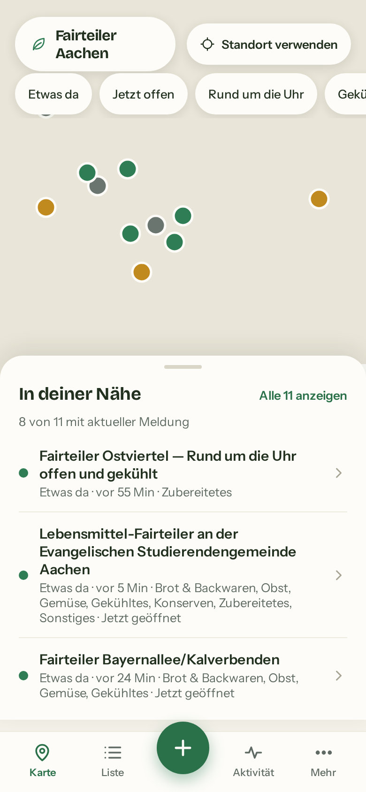
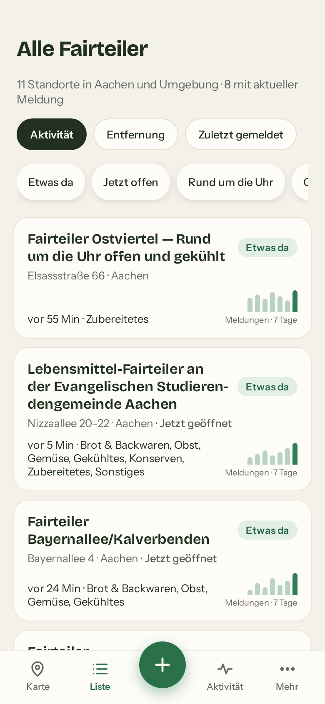
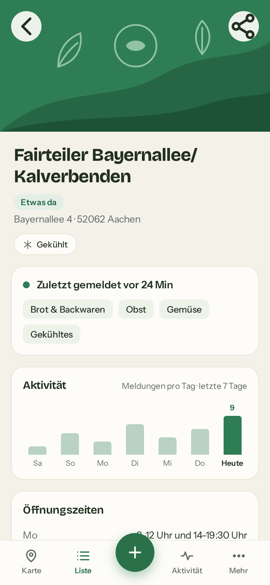
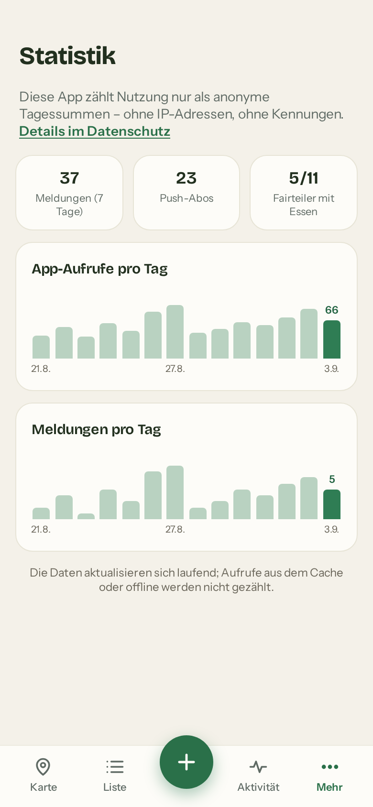

# Fairteiler Aachen

Mobile-first companion PWA for the Fairteiler (food-share points) in Aachen —
live "is food there right now?" status and per-Fairteiler activity, crowd-
reported in 10 seconds without a login. Co-exists with
[foodsharing.de](https://foodsharing.de/region/aachen); it fills the gaps the
core platform has left open (see `IMPLEMENTATION_PLAN.md` for the issue-tracker
evidence), it does not replace it.

## Screenshots

| Karte | Liste | Detail | Statistik |
|---|---|---|---|
|  |  |  |  |

## What's here

| Path | Content |
|---|---|
| `design/` | Design sources: one `.dc.html` per screen + `canvas.json` layout, plus the seeded design-canvas file |
| `prototype/index.html` | Self-contained clickable prototype — open it on a phone |
| `IMPLEMENTATION_PLAN.md` | Gap analysis, architecture, milestones |
| `backend/` | FastAPI API (live status, reports, activity) — `python -m pytest` |
| `frontend/` | Vue 3 PWA |
| `scripts/fetch_upstream.py` | One-time/daily seed of master data (be gentle: run at most 1×/day; raw responses stay untracked) |

## Development

```bash
# backend (Python ≥3.12)
cd backend && python3 -m venv .venv && .venv/bin/pip install -r requirements.txt
.venv/bin/python -m pytest        # tests
.venv/bin/python run.py           # API on :8000, SQLite + seed

# frontend
cd frontend && npm install
npm run test                      # vitest
npm run dev                       # dev server, proxies /api to :8000
```

## Showing the prototype on a phone

`prototype/index.html` is a single static file with no build step:

```bash
python3 -m http.server 8080          # then open http://<your-ip>:8080/prototype/ on the phone
```

or push this repo to GitLab/GitHub and enable Pages.

## License

AGPL-3.0-only — see LICENSE.

## Status

M1 + M2 complete and tested (117 tests): live status, reporting,
activity, schematic map, installable PWA, self-hosted web push,
moderation and retention tooling. Deployment to Uberspace prepared
(`deploy/uberspace/`); waiting on account details and the Impressum/
Datenschutz `[PLACEHOLDER]` values before going live.
